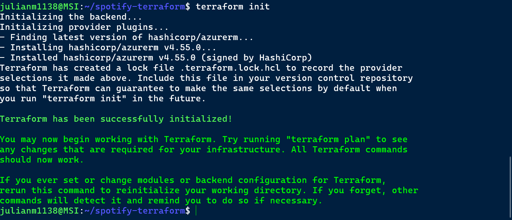
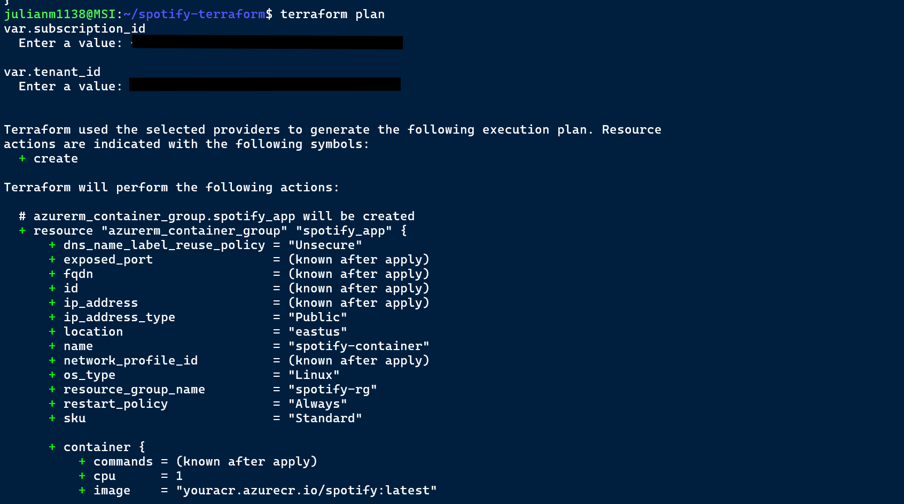
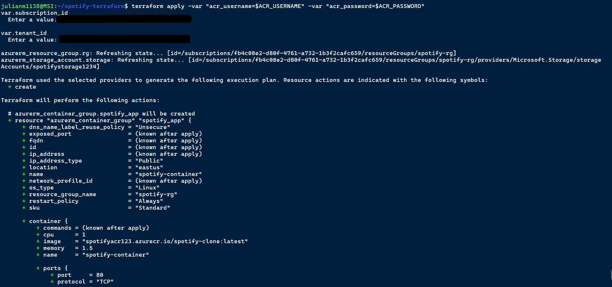
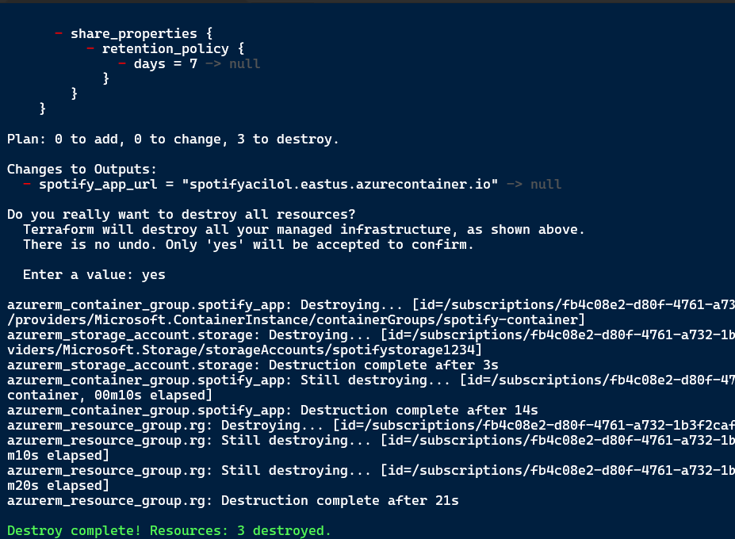

# Spotify Clone - Terraform Deployment

This repository contains Terraform code to deploy a containerized React + TypeScript Spotify clone to **Azure**.

## Overview

- **Resources Provisioned:**
  - Azure Resource Group
  - Azure Container Registry (ACR) container group
  - Azure Storage Account
- **App Deployment:**
  - Dockerized Spotify clone image deployed to Azure Container Apps
  - CI/CD pipeline assumed via GitHub Actions (outside this repo)
- **Concepts Demonstrated:**
  - Terraform basics: resources, variables, outputs
  - Environment variable usage for secrets
  - Azure cloud services automation
  - Idempotent infrastructure management (create, update, destroy)

## Files

- `main.tf` – Core provider configuration and resource group
- `deploy.tf` – Container group deployment with Docker image
- `storage.tf` – Azure Storage Account provisioning
- `variables.tf` – Input variable declarations

## Usage

1. Clone the repo:

   ```bash
   git clone <repo-url>
   cd spotify-terraform
   ```

````

```bash
export ARM_SUBSCRIPTION_ID="<your-subscription-id>"
export ARM_TENANT_ID="<your-tenant-id>"
export ACR_USERNAME="<your-acr-username>"
export ACR_PASSWORD="<your-acr-password>"
````

```bash
terraform init
```



```bash
terraform plan
```



```bash
terraform apply
```



```bash
terraform destroy
```




